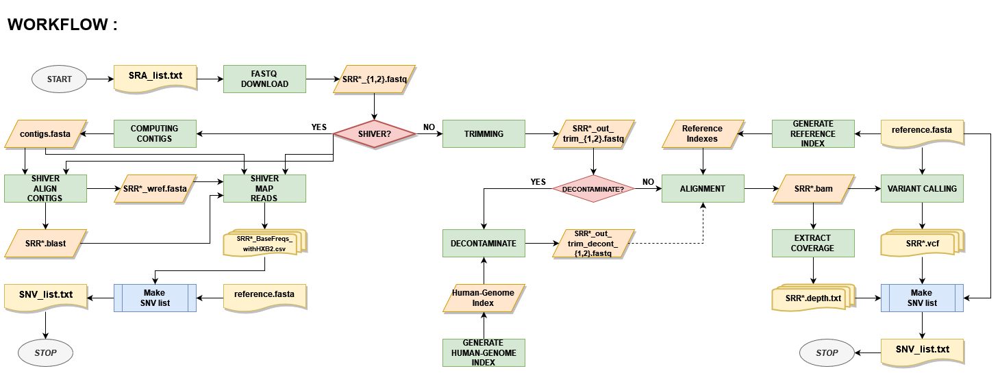

# Preprocessing for Mutational signatures (via Docker)
Re-styling preprocessing for [VirMutSig](https://github.com/BIMIB-DISCo/VirMutSig) for HIV.

## Technologies
***
* [Nextflow](https://www.nextflow.io/)
* [Docker](https://www.docker.com/)
* [Shiver](https://github.com/ChrisHIV/shiver)

## What is it for
***
This is a pipeline that could be used to pre-process FASTQ files (**from Paired-End Libraries**) from VIRAL RNA (given by SRA accession number) using SHIVER method or classic (trim, align and variant calling):
 - inputs: 
    - SRA accession number list [ ***SRA_list.txt*** ] (one per line)
 - major output ( saved ):
    - SNV (Single Nucleotide Variant) list [ ***SNV_list.txt*** ] (under certain customizable constraints)
    - aligned files for every samples [ ***SRR\*.BAM*** ] using one of three possible aligners (bowtie2, bwa, smalt)
    - SHIVER major output files
    - VCF files resulting from variant calling [ ***SRR\*.vcf*** ]

Workflow:

## Prerequisites
***
### Essential:
- Nextflow prerequisites (see [quick start](https://www.nextflow.io/))
- Knowledge of SHIVER method
### Not essential:
- easy way:
    - Docker installed (see [how to get Docker](https://docs.docker.com/get-docker/))
- custom way:
    - Ubuntu (20.4) it may work with other versions (or OS) as well but has not been tested yet (see docker file for all the info about dependencies).

## Constraints
***
This pipeline was designed for NGS data that have the following characteristics or limits:
- paired ends data only
- need to have SRA accession number of samples
- need to know about reads name for SHIVER methods (the process is insert.nf)

## How to start
***
Starting is just about:
1. Build Docker image to create container where to run the pipeline from Nextflow. Once downloaded this project and inside main directory, just run the following commands:
> ```
> $ docker pull ncbi/sra-tools
> $ docker build -t preprocessing .
> ```
2. Insert in **reference** directory the chosen reference sequence.

3. Overwrite ***SRA_list.txt*** with SRA accesion number of the samples. 

4. Open ***nextflow.config*** file and overwrite this parameters :

    1. *params.decontaminate* : need to change if you want to decontaminate fastq file from reads that match with human genome.
    2. *params.deduplicate* : need to change if you want to not de-duplicate reads.
    3. *profiles->local->process->withName:Contigs->cpus* : this parameter should make faster (or slower) the execution of contigs computing (need this for SHIVER method) based on the number of core used in this process. 
    4. *profiles->local->process->withName:Make_SNV_list_SHIVER->cpus* : this parameter should make faster (or slower) the execution of SNV list file computing (need this for SHIVER method) based on the number of core used in this process.
    5. make the same as 3. and 4. for profile ***docker***

5. Overwrite ( if necessary ):
    1. ***shiver_setting/MyConfig_bowtie2.sh***
    2. ***shiver_setting/MyConfig_bwa.sh***
    3. ***shiver_setting/MyConfig_smalt.sh***
    4. ***reference/MyAdapters.fasta***
    5. ***reference/MyPrimers.fasta***
    6. ***reference/reference.fasta***

    to do this (adapt the pipeline to the purpose) need to know about SHIVER's method (linked above).

## How to run
***
Once created the Docker image and changed the parameters (and files), you have to run this commands choosing the right options:
> ```
> $  ./nextflow run preprocess.nf -profile docker --aligner [ bowtie2 || bwa || smalt ] --mode [ shiver || classic ]
> ```
<!--- Comments are Fun 
## How to install (custom way)
***
This mode of use is not recommended and has not been thoroughly tested to be able to consider it correct.
Installation is just about:
1. Using Ubuntu (20.04) execute all the CMD command (better if in roder) in ***Dockerfile*** (even the ENV command for PATH), in particular you have to execute commands regarding the initial SHIVER configuration in the main folder of the pipeline.

2. In the main directory of this pipeline there must be the following folders and files (following the CMD in ***Dockerfile*** this will happen automatically) :
    1. **shiver-1.5.8** (simply the download of SHIVER version 1.5.8)
    2. **shiver_settings/setting_bowtie2**
    3. **shiver_settings/setting_bwa**
    4. **shiver_settings/setting_smalt**
    5. ***shiver_settings/MyConfig_bowtie2.sh***
    6. ***shiver_settings/MyConfig_bwa.sh***
    7. ***shiver_settings/MyConfig_smalt.sh***

3. Overwrite the reference fasta file ***reference/reference.fasta*** with the choosen sequence.

4. Overwrite ***SRA_list.txt*** with SRA accesion number of the samples. 

5. Open ***nextflow.config*** file and overwrite this parameters :

    1. *profiles->local->process->withName:Contigs->cpus* : this parameter should make faster (or slower) the execution of contigs computing (need this for SHIVER method) based on the number of core used in this process. 
    2. *profiles->local->process->withName:Make_SNV_list_SHIVER->cpus* : this parameter should make faster (or slower) the execution of SNV list file computing (need this for SHIVER method) based on the number of core used in this process.
    3. make the same as 2. and 3. for profile ***docker***

6. Overwrite :
    1. ***shiver_setting/MyConfig_bowtie2.sh***
    2. ***shiver_setting/MyConfig_bwa.sh***
    3. ***shiver_setting/MyConfig_smalt.sh***
    4. ***reference/MyAdapters.fasta***
    5. ***reference/MyPrimers.fasta***

    to do this (adapt the pipeline to the purpose) need to know about SHIVER's method (linked above).

## How to use (custom way)
***
Once created the Docker image, you have to see trough the file ***nextflow.config*** to check you have only to run this commands choosing the right options:
```
$  ./nextflow run preprocess.nf -profile local --aligner [ bowtie2 || bwa || smalt ] --mode [ shiver || classic ]
```
-->
## Options discovery
***
* ``` -profile ( docker || local )``` : this option tells about the subsystem will run the pipeline, in case of ``` local ``` be sure to have all the necessary requirements installed ( read Dockerfile to know more about this ). However, it is advisable to use the option ``` docker ```.

* ``` --aligner ( bowtie2 || bwa || smalt ) ``` : simply choosing the suitable aligner.

* ``` --mode ( shiver || classic ) ``` : this options makes you choosing trough classic manner (align against a reference sequence) or SHIVER method (follow the link above in section technologies to discover SHIVER).

## Customize
***
The following processes can be customized by overwrite some variables in the corresponding files:
* ***trimming.nf***
* ***variant_calling.nf***
* ***make_snv_list.nf*** with ``` --mode  classic ```